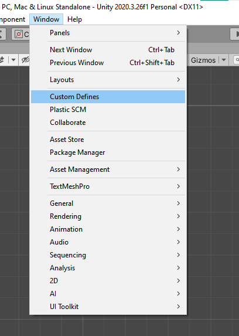
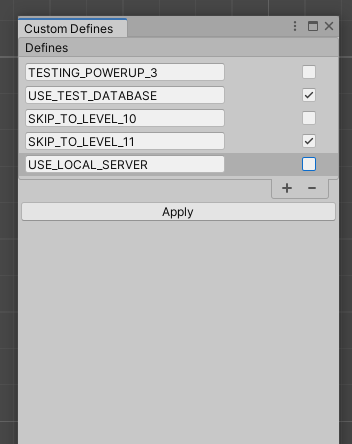

# UnityCustomDefines

Easily enable/disable custom preprocessor defines in Unity for all platforms.

## Usage

To access the **Custom Defines** editor window after importing the Unity package, navigate to **Window** > **Custom Defines** in the Unity Editor menu.

You can add, enable, disable and remove custom preprocessor defines as needed.

When you're done with the modifications, click **Apply** and wait for the script recompilation to complete.